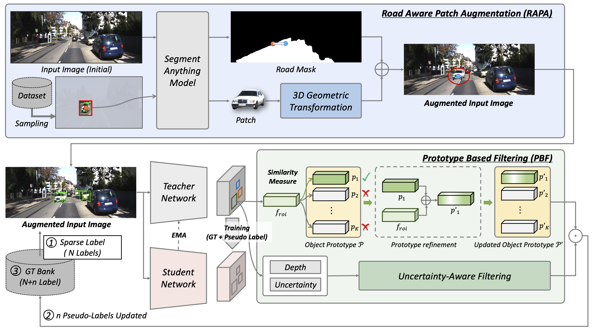

# MonoSAOD: Monocular 3D Object Detection with Sparsely Annotated Label

[](https://arxiv.org/pdf/2604.01646)
[](https://visualaikhu.github.io/MonoSAOD/)

The paper has been accepted by CVPR 2026.

Official implementation of **MonoSAOD: Monocular 3D Object Detection with Sparsely Annotated Label**

## Introduction
 


## Introduction

MonoSAOD is the first framework to address sparsely-annotated monocular 3D object detection. 
Unlike existing methods that assume fully labeled 3D annotations, we explicitly tackle the realistic setting where only a fraction of visible objects are annotated.

We introduce a geometry-consistent augmentation module (RAPA) and a prototype-guided pseudo-label filtering module (PBF). 
RAPA leverages sparse ground truths by placing clean object patches onto valid road regions while preserving 3D geometric consistency. 
PBF selects reliable pseudo-labels by jointly evaluating feature-level prototype similarity and depth uncertainty, preventing erroneous 3D supervision.

By combining geometry-aware augmentation and uncertainty-aware pseudo-labeling within a teacher–student framework, MonoSAOD enables robust 3D learning under severe annotation sparsity.


## Table of Contents

- [Introduction](#introduction)
- [Installation](#installation)
- [Dataset](#dataset)
- [Training](#training)
- [Evaluation](#evaluation)
- [Pretrained Models](#pretrained-models)

## Installation

### Requirements

- Python 3.8+
- PyTorch 1.9+
- CUDA 11.0+
- Other dependencies as specified in requirements (if available)

### Setup

1. Clone the repository:
```bash
git clone https://github.com/isaccKim/MonoSAOD.git
cd MonoSAOD
```

2. Create a virtual environment (optional but recommended):
```bash
python -m venv venv
source venv/bin/activate  # On Windows: venv\Scripts\activate
```

3. Install dependencies:
```bash
pip install -r requirements.txt  # If available
# Or manually install:
pip install torch torchvision torchaudio
pip install pyyaml numpy scipy
```

4. Build the Multi-Scale Deformable Attention (CUDA extensions):
```bash
cd lib/models/monodetr/ops
python setup.py build_ext --inplace
cd ../../../..
```

## Dataset

### KITTI 3D Object Detection Dataset

This project uses the KITTI 3D object detection dataset with patch augmentation. To prepare the dataset:

1. Download KITTI dataset from [here](http://www.cvlibs.net/datasets/kitti/eval_object.php)

2. Extract and organize the dataset:
```
KITTI/object/
├── training/
│   ├── calib/
│   ├── image_2/
│   ├── velodyne/
│   ├── 30/                     # sparsity 
│   │   ├── patch/              # Patch images
│   │   └── label_patch/        # Patch labels
│   └── patch_dirs/
│       └── road_masks/         # Road masks for patch augmentation
└── testing/
    ├── calib/
    ├── image_2/
    └── velodyne/
```

3. Update the dataset path in `configs/monodetr.yaml`:
```yaml
dataset:
  root_dir: '/path/to/KITTI/object/'
  patch_dir: '/path/to/KITTI/object/training/30/patch'
  patch_label_dir: '/path/to/KITTI/object/training/30/label_patch'
  mask_dir: '/path/to/KITTI/object/training/patch_dirs/road_masks'
```

### Patch Augmentation Setup

The model uses patch-based augmentation. Here's how to set it up:

1. **Prepare patch directory structure:**
```bash
mkdir -p KITTI/object/training/30/patch
mkdir -p KITTI/object/training/30/label_patch
mkdir -p KITTI/object/training/patch_dirs/road_masks
```

2. **Place patch files:**
   - **`patch/`**: Contains cropped object patches from training images
   - **`label_patch/`**: Contains corresponding labels for patches
   - **`road_masks/`**: Contains binary masks of road regions for augmentation

3. **Generate patches (if needed):**
   - Use the provided scripts in `lib/datasets/kitti/patch_augmentation.py` to generate patches from KITTI training data
   - Patches should be small cropped images of detected objects

### Dataset Configuration

Key configuration options in `configs/monodetr.yaml`:

- `train_split`: Training data split (default: 'train')
- `test_split`: Testing data split (default: 'val')
- `batch_size`: Batch size for training (default: 16)
- `use_3d_center`: Use 3D center as target (default: True)
- `writelist`: Classes to detect (default: ['Car'])

## Generating Patches (Optional)

If you need to generate patches from KITTI training data:

1. **Run the patch generation script:**
```bash
cd lib/datasets/kitti
python patch_augmentation.py --kitti_root /path/to/KITTI/object \
                             --output_dir /path/to/KITTI/object/training/30 \
                             --split train
cd ../../../
```

2. **Output structure:**
```
training/30/
├── patch/              # Generated patch images
│   ├── 000000_0.png
│   ├── 000000_1.png
│   └── ...
└── label_patch/        # Generated patch labels
    ├── 000000_0.txt
    ├── 000000_1.txt
    └── ...
```

3. **Road masks generation (if needed):**
   - Generate binary masks for road regions
   - Place them in `training/patch_dirs/road_masks/`
   - Used for more realistic patch placement during augmentation

## Training

### Basic Training

To start training with the default configuration:

```bash
python tools/train_val.py --config configs/monodetr.yaml
```

Or using the provided script:
```bash
./train.sh configs/monodetr.yaml
```

### Training Configuration

Key hyperparameters in `configs/monodetr.yaml`:

- **Model**: ResNet50 backbone with depth-aware transformer
- **Depth Predictor**: LID mode with 80 depth bins
- **Batch Size**: 16
- **Learning Rate**: Configured in the yaml file
- **Epochs**: Configured in the yaml file

### Output

Training outputs are saved to:
```
logs/monodetr/
├── train.log.*
├── checkpoints/
└── ...
```

## Evaluation

### Evaluate on Test Set

To evaluate the model on the test set:

```bash
python tools/train_val.py --config configs/monodetr.yaml -e
```

Or with the short flag:
```bash
python tools/train_val.py --config configs/monodetr.yaml --evaluate_only
```

### Metrics

The evaluation reports standard KITTI metrics:
- Average Precision (AP) for each difficulty level (Easy, Moderate, Hard)
- Averaged over different IoU thresholds

## Pretrained Models

If you have a pretrained checkpoint, you can load it by specifying in the config:

```yaml
teacher_checkpoint: '/path/to/checkpoint.pth'
```

The model uses a student-teacher learning approach where:
- **Student Model**: Trainable model
- **Teacher Model**: EMA-updated copy of the student model

## Model Architecture

- **Backbone**: ResNet50
- **Neck**: Multi-scale feature extraction
- **Head**: Depth-aware Transformer with deformable attention
- **Depth Predictor**: Estimates depth distribution for each object

## Directory Structure

```
MonoSAOD/
├── configs/              # Configuration files
├── lib/
│   ├── datasets/        # Dataset loaders
│   │   └── kitti/       # KITTI-specific code
│   ├── helpers/         # Training helpers
│   ├── losses/          # Loss functions
│   └── models/          # Model definitions
│       └── monodetr/    # MonoDETR model
├── tools/
│   └── train_val.py     # Training and evaluation script
├── train.sh             # Training script
└── README.md            # This file
```

## License

This project is based on MonoDETR. Please refer to the LICENSE file for more information.

## Citation

If you use this code in your research, please cite:

```bibtex
@inproceedings{jung2026monosaod,
  title={MonoSAOD: Monocular 3D Object Detection with Sparsely Annotated Label},
  author={Jung, Junyoung and Kim, Seokwon and Kim, Jung Uk},
  booktitle={Proceedings of the IEEE/CVF Conference on Computer Vision and Pattern Recognition},
  pages={4718--4727},
  year={2026}
}
```
